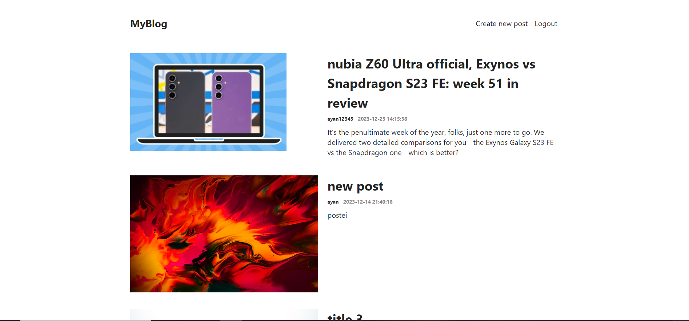
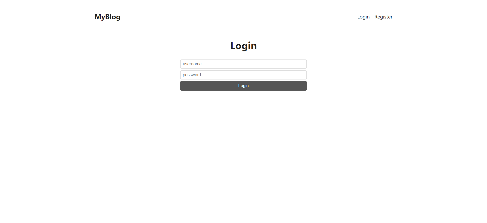
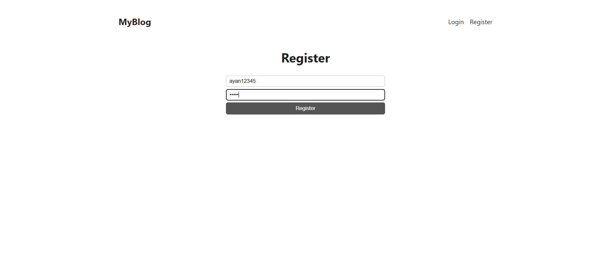
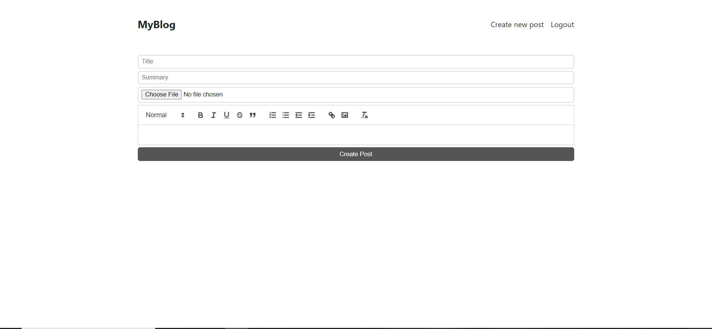
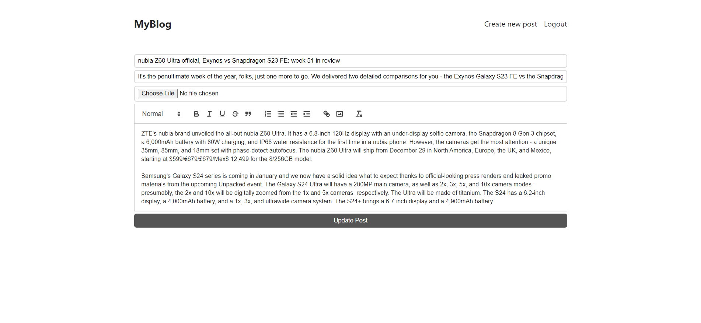
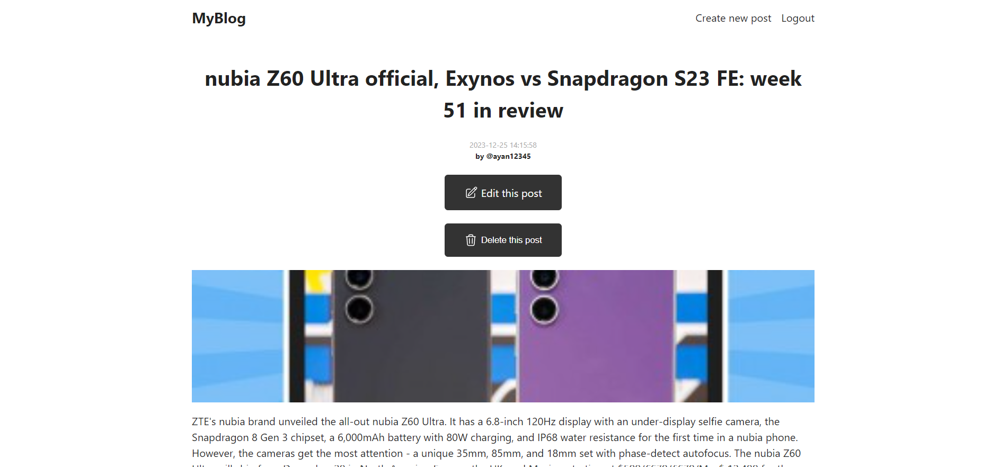

# Blogging Platform Project

## Overview
- This project is a full-stack blogging platform that allows users to create an account, write blog posts, view posts, and manage their content.

## Technologies Used

### Frontend
- React
- React Router DOM
- User Context API

### Backend
- Node.js
- Express.js
- MongoDB (via Mongoose)
- JSON Web Tokens (JWT) for authentication

## Functionalities

### Backend Features

- **User Authentication**:
  - User registration with hashed passwords.
  - User login and JWT-based authentication for subsequent requests.
  - Secure password hashing using bcrypt.
  - Logout functionality to clear user sessions.
  
- **Post Management**:
  - Create new posts with a title, summary, content, and cover image.
  - Update posts, including title, summary, content, and cover image (restricted to the post author).
  - Delete posts (restricted to the post author).

### Frontend Features

- **Routing**:
  - Utilizes React Router DOM for navigation and rendering different components based on routes.
  - Pages include:
    - IndexPage: Displays a list of recent posts.
    - LoginPage: Allows users to log in to their accounts.
    - RegisterPage: Enables new user registration.
    - CreatePost: Provides a form to create new blog posts.
    - PostPage: Displays a single post with its content.
    - EditPost: Allows editing of existing posts.
- **User Context**:
  - Manages user-related information across components.

## Getting Started

### Installation

- Clone the repository.
- Navigate to the frontend and backend directories separately.
- Run `npm install` to install dependencies.

### Running the Application

- Start the backend server:
  - Run `nodemon index.js` in the backend directory.
- Launch the frontend:
  - Run `npm start` in the frontend directory.

## Usage

- Access the application through the specified routes:
  - Register a new account or log in with existing credentials.
  - Create, view, edit, and delete blog posts.
  - Navigate between different pages using the provided links and buttons.

## Contributing

- Contributions are welcome! Feel free to fork the repository, make changes, and submit pull requests.

## License

- This project is licensed under the MIT License.

## Screenshots
### Homepage

### Login Page

### Register Page

### Create Post Page

### Edit Post Page

### Single Post Page

